# GDF-AutoMon — Layer & Data Flow Diagrams

Each diagram zooms into a single layer or a specific end-to-end scenario. Read them in order for the full picture, or jump to the scenario you care about.

---

## Contents

**Layers (what exists at rest)**
- [L1 — Physical Sensor Layer](#l1--physical-sensor-layer)
- [L2 — Edge Firmware Layer](#l2--edge-firmware-layer)
- [L3 — Wireless Network Layer](#l3--wireless-network-layer)
- [L4 — MQTT Broker Layer](#l4--mqtt-broker-layer)
- [L5 — Application Server Layer](#l5--application-server-layer)
- [L6 — Host & Infrastructure Layer](#l6--host--infrastructure-layer)
- [L7 — Client Delivery Layer](#l7--client-delivery-layer)

**Data Flows (what moves at runtime)**
- [F1 — Sensor Reading → Live Dashboard](#f1--sensor-reading--live-dashboard)
- [F2 — Alert Threshold Breach → Push Notification](#f2--alert-threshold-breach--push-notification)
- [F3 — Alert Breach → Twilio SMS & Voice Call](#f3--alert-breach--twilio-sms--voice-call)
- [F4 — User Opens Historical Chart](#f4--user-opens-historical-chart)
- [F5 — Task Deadline Reminder](#f5--task-deadline-reminder)
- [F6 — PWA Install & First Offline Load](#f6--pwa-install--first-offline-load)
- [F7 — New Sensor Registered (Admin Flow)](#f7--new-sensor-registered-admin-flow)
- [F8 — Full End-to-End: Sensor Spike to Resolved Alert](#f8--full-end-to-end-sensor-spike-to-resolved-alert)

---

## L1 — Physical Sensor Layer

What sensors are physically attached to what hardware, and how.

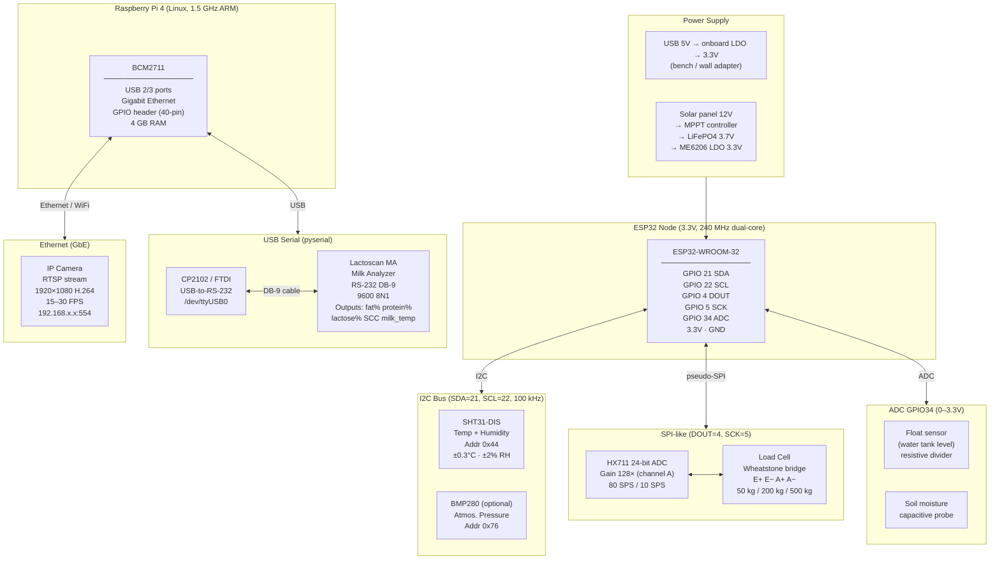

---

## L2 — Edge Firmware Layer

The code running on each edge device — what it does step by step.

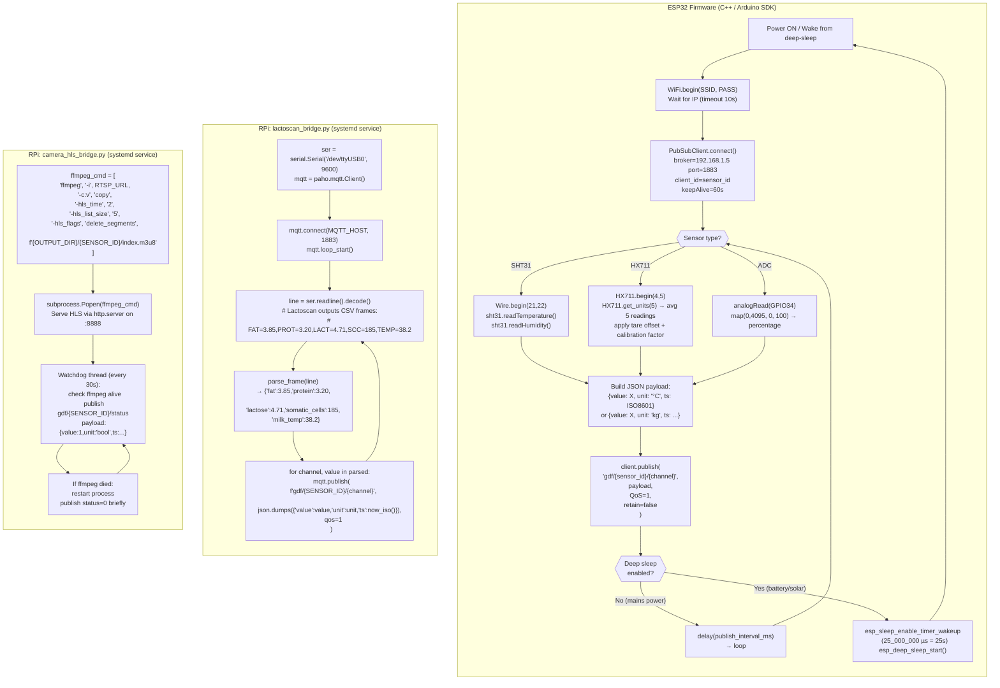

---

## L3 — Wireless Network Layer

How every device connects, what protocol runs over which medium.

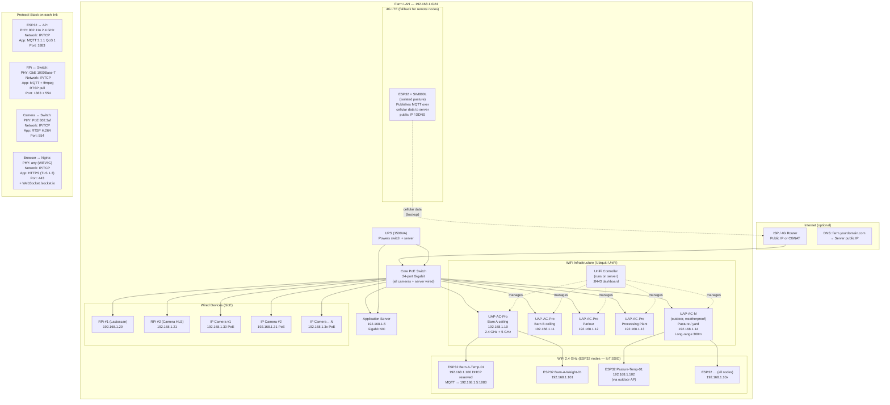

---

## L4 — MQTT Broker Layer

Inside EMQX — topic routing, subscriber management, QoS guarantees.

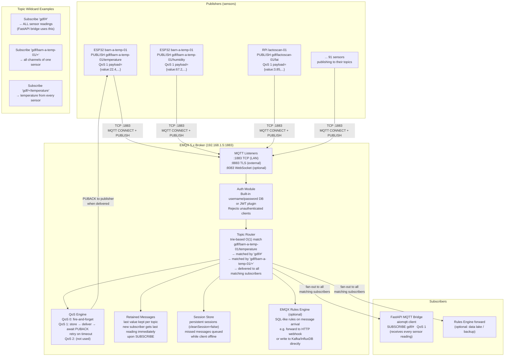

---

## L5 — Application Server Layer

Every service running on the server and how they talk to each other.

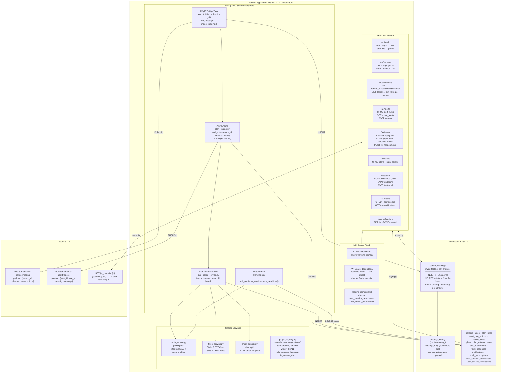

---

## L6 — Host & Infrastructure Layer

Docker containers, volumes, Nginx routing, and cloud/VPS placement.

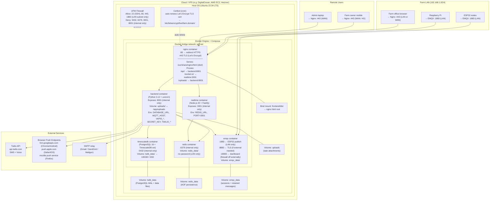

---

## L7 — Client Delivery Layer

Everything that runs inside the browser (or as an installed PWA).

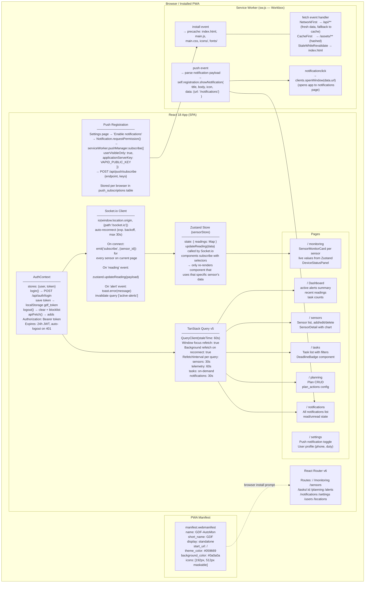

---

## F1 — Sensor Reading → Live Dashboard

The happy path: a temperature value travels from sensor to browser pixel.

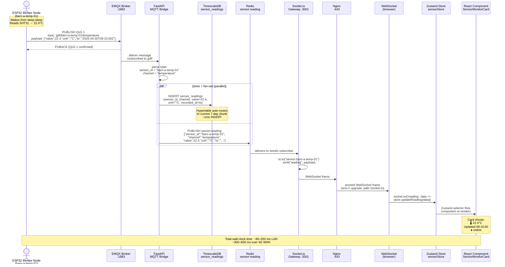

---

## F2 — Alert Threshold Breach → Push Notification

Temperature crosses the configured limit; the right people are notified.

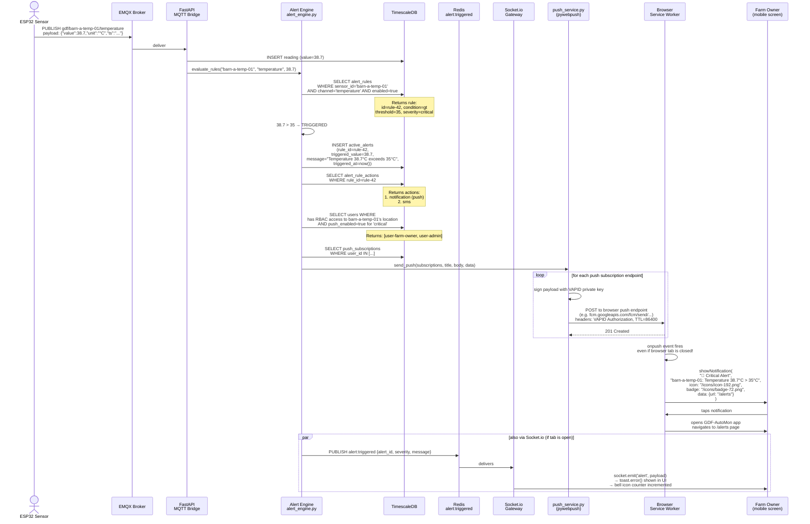

---

## F3 — Alert Breach → Twilio SMS & Voice Call

When push alone isn't enough — critical alerts reach the user's phone directly.

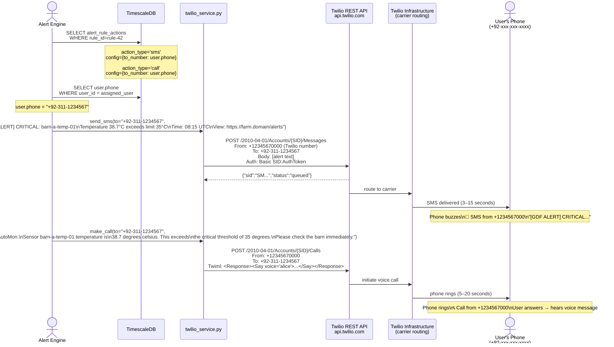

---

## F4 — User Opens Historical Chart

A chart request: from browser click to rendered graph.

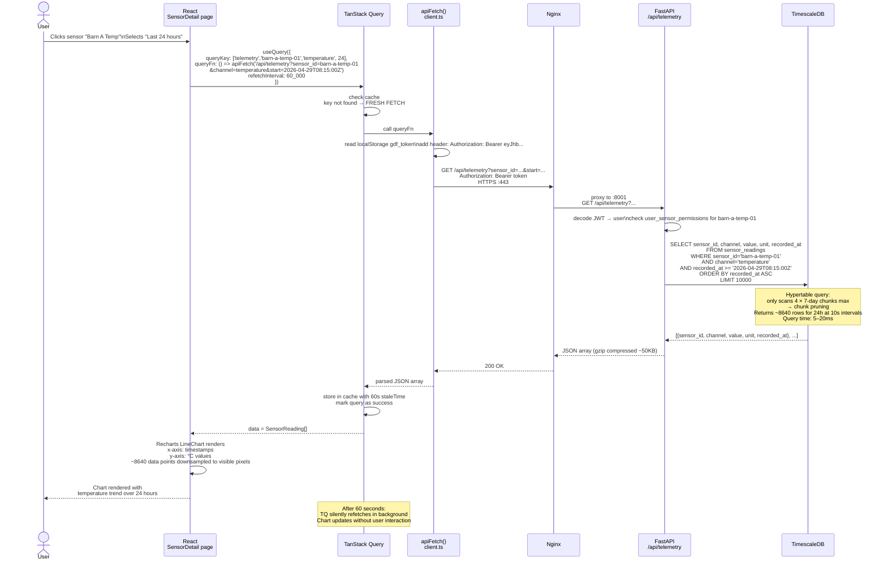

---

## F5 — Task Deadline Reminder

A task is approaching its deadline and assignees are reminded automatically.

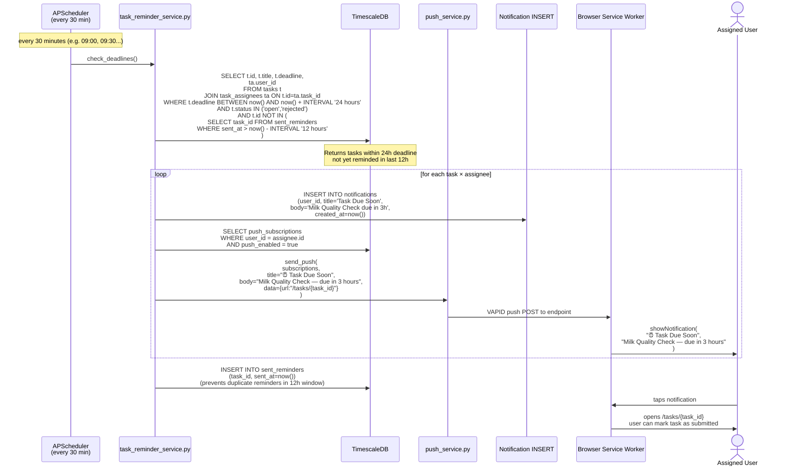

---

## F6 — PWA Install & First Offline Load

How a user installs the app and what happens when they're offline.

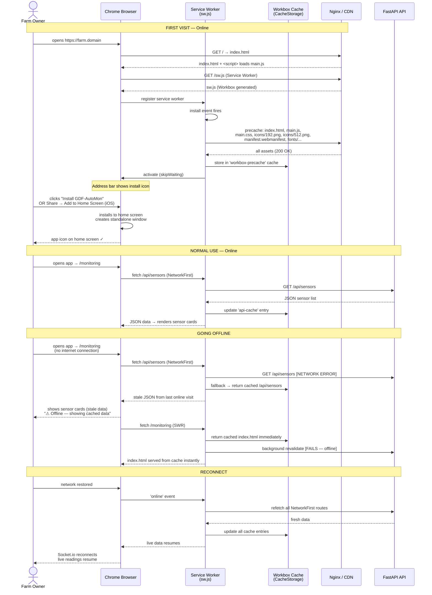

---

## F7 — New Sensor Registered (Admin Flow)

An admin adds a new ESP32 sensor through the UI and the system activates it.

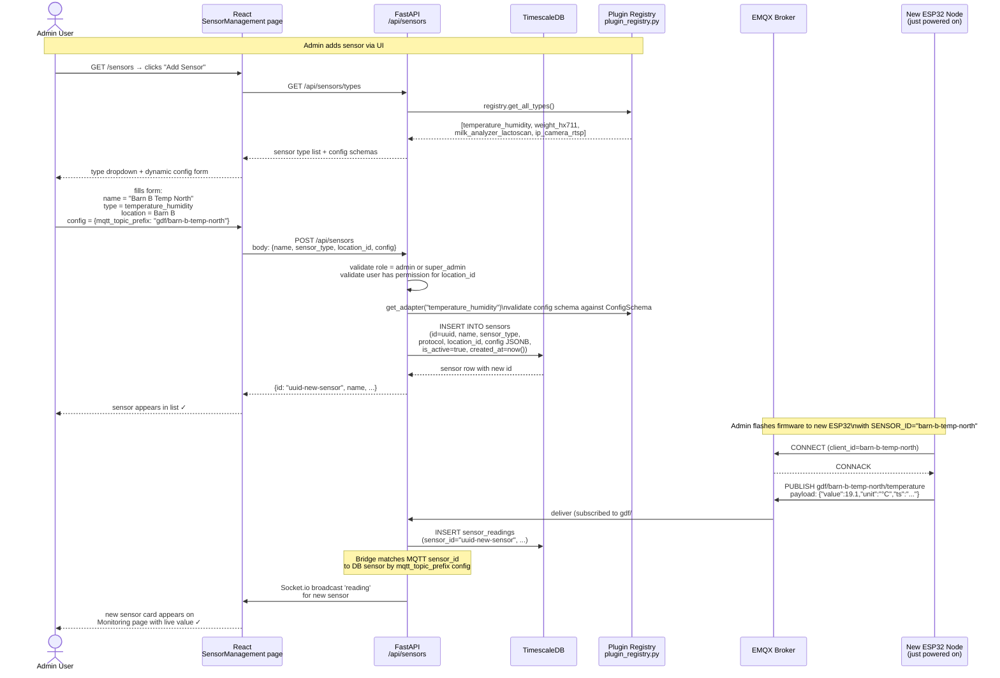

---

## F8 — Full End-to-End: Sensor Spike to Resolved Alert

Complete lifecycle of a critical event from first anomalous reading to admin marks resolved.

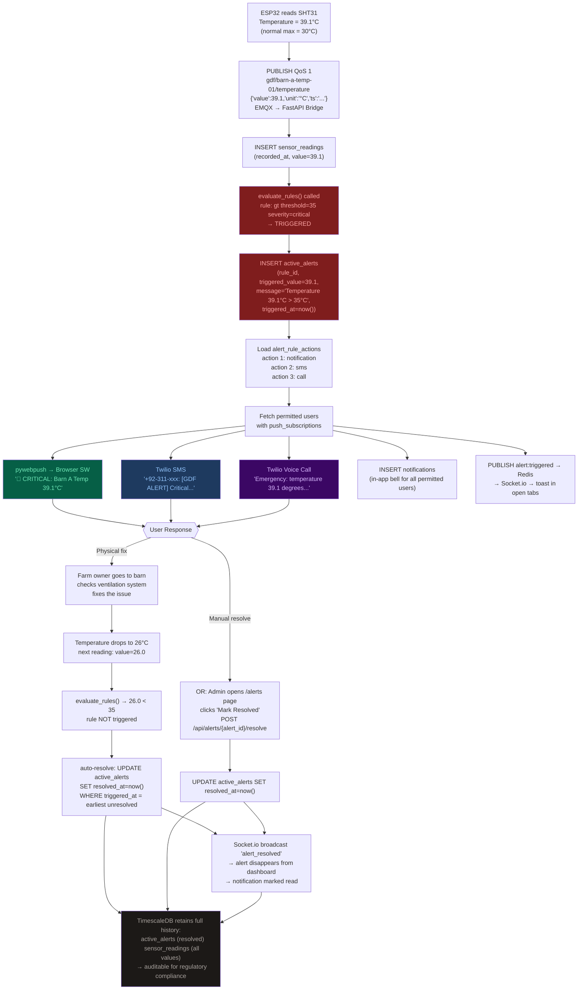

---

## Quick Reference: Layer Stack

```
┌─────────────────────────────────────────────────────────────────┐
│  L7  Client Browser / PWA                                       │
│       React 18 · Zustand · TanStack Query · Socket.io-client    │
│       Service Worker (Workbox) · PWA Manifest                   │
├─────────────────────────────────────────────────────────────────┤
│  L6  Host Infrastructure                                        │
│       Nginx :443  ·  Docker Compose (7 containers)              │
│       VPS / cloud server  ·  Let's Encrypt TLS                  │
├─────────────────────────────────────────────────────────────────┤
│  L5  Application Server                                         │
│       FastAPI :8001  ·  TimescaleDB :5432  ·  Redis :6379       │
│       Socket.io Gateway :3001                                   │
├─────────────────────────────────────────────────────────────────┤
│  L4  MQTT Broker                                                │
│       EMQX 5.x :1883 / :8883                                    │
│       topic: gdf/{sensor_id}/{channel}  ·  QoS 1               │
├─────────────────────────────────────────────────────────────────┤
│  L3  Wireless Network                                           │
│       Ubiquiti UniFi APs  ·  PoE switch  ·  LAN 192.168.1.0/24 │
│       2.4 GHz (ESP32)  ·  Gigabit Ethernet (RPi + cameras)     │
├─────────────────────────────────────────────────────────────────┤
│  L2  Edge Firmware                                              │
│       ESP32 C++ (Arduino SDK)  ·  RPi Python bridges            │
│       Deep-sleep  ·  pyserial  ·  ffmpeg  ·  paho-mqtt          │
├─────────────────────────────────────────────────────────────────┤
│  L1  Physical Sensors                                           │
│       SHT31 (I2C)  ·  HX711 (pseudo-SPI)  ·  Lactoscan (RS-232)│
│       IP Cameras (RTSP)  ·  Load cells  ·  ADC probes           │
└─────────────────────────────────────────────────────────────────┘
```

*Diagrams version: April 2026 · GDF-AutoMon v1.x*
